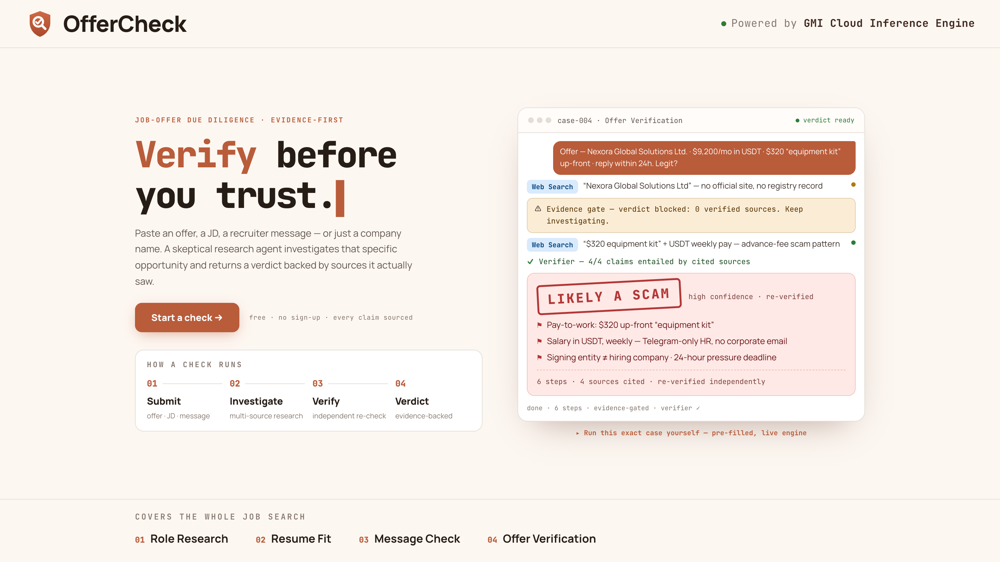
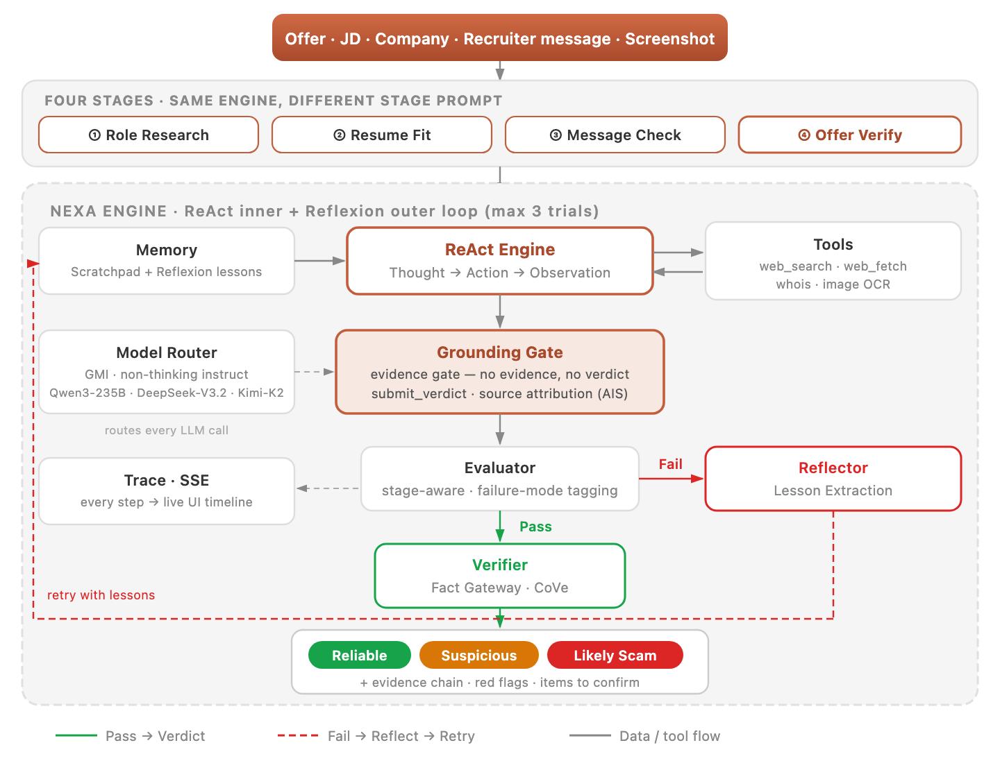

# OfferCheck — Job Offer Due-Diligence Agent

<p align="center">
  <a href="https://offercheck.up.railway.app/">
    
  </a>
</p>

<p align="center">
  <a href="https://offercheck.up.railway.app/"></a>
  &nbsp;
  &nbsp;
  &nbsp;
</p>

> A skeptical research copilot for job seekers. Paste an offer, JD, company name, recruiter message, or screenshot — it independently investigates that **specific opportunity** on the live web and returns a verdict of **Looks Legit / Suspicious / Likely a Scam**, with a source-verified evidence chain and items for you to confirm yourself.

**Live demo**: https://offercheck.up.railway.app/ — try: *“I received an offer from apple-hiring-team.com asking for a $200 gift-card background-check fee — is this legit?”*

- **Actively falsifies, not statically scores** — targets the highest-frequency scam pattern: impersonation of real companies (forged offers, lookalike domains, fake HR). Competitors return a static company credit score; OfferCheck investigates *this* opportunity, multi-source, and links every conclusion to sources it actually retrieved.
- **No evidence, no verdict** — a four-layer grounding stack (grounding rules → mandatory-evidence gate → structured `submit_verdict` → source-attribution audit) blocks hallucinated verdicts by design.
- **One engine, full journey** — role research → resume fit → recruiter-message check → offer verification run on a single autonomous investigation engine (per-stage prompts), with cross-stage memory carry-over and in-conversation capability routing.
- **Dual official providers** — DeepSeek-V4 Pro/Flash for strong/fast reasoning and Moonshot Kimi K2.6 for tool-call upgrade and cloud vision, routed per tier.

<p align="center">
  
</p>

---

## Four stages (one engine, different stage prompts)

| Stage | Input | What the agent does autonomously | Output |
|---|---|---|---|
| ① Role Research | Resume + target/candidate companies | Verifies business reality, funding health, team background, ghost jobs | Priority recommendation + evidence |
| ② Resume Fit | JD + resume | Locates gaps: “highlight these / add these” | Targeted edit checklist (with evidence) |
| ③ Message Check | Recruiter messages / screenshots | Verifies identity, detects abnormal communication (advance fees / no-interview hires / urgency pressure) | Red-flag list + advice |
| ④ Offer Verification (core) | Offer/contract + full-journey context | Deepest cross-validation, actively seeks counter-evidence | Three-state verdict + evidence chain + items to confirm |

**Grounding first — better “Suspicious” than fabricated**: every conclusion must be bound to **actually retrieved** evidence. Four defense layers shut down hallucination — grounding rules in the system prompt → mandatory-evidence gate (no evidence, no verdict) → structured `submit_verdict` termination → AIS source attribution (fabricated sources flagged `⚠️ [unverified]`).

---

## The engine underneath: Nexa Agent

A scenario-agnostic, reusable investigation core (headless — no FastAPI/DB/UI; importable or runnable from the CLI):

- **ReAct + Reflexion dual loop**: native tool calling inside the trial (OpenAI-compatible — no regex parsing failures) + self-reflective retries outside it (Trial → Evaluate → Verify → Reflect)
- **12 tools**: `web_search` / `wikipedia_search` / `web_fetch` / `tavily_extract` / `read_pdf` / `read_xlsx` / `calculator` / `analyze_image` (on-device MiniCPM-V) / `analyze_image_cloud` (Gemini 3.1) / `save_content` / `get_current_time` / `domain_whois_lookup`
- **Tiered model routing**: strong (first-step planning / verdict) + fast (subsequent steps / reflection / evaluation) + upgrade (tool-call fallback, dynamic escalation)
- **Mid-course correction**: cross-tool URL dedup + early loop detection + strategy switching + tiered observation truncation
- **Verifier fact gateway**: conclusions bound to `[Fact]/[Source]/[Confidence]`, stage-aware calibration + per-fact CoVe verification
- **Eval Harness**: regression evaluation pipeline + failure-mode attribution + run comparison (`compare` with a 2pp regression gate)
- **Observability**: structured trace emission hook (`on_event`) → tool/source/step/verdict event stream, bridged to SSE by the server layer
- **Pluggable search layer**: Tavily → Exa → DuckDuckGo ordered fallback + health-based circuit breaking

```
One investigation, the core loop (nexa_agent):
  ReflexionReActAgent.execute(task, stage, on_event)
    ├─ Trial 1~N (Reflexion outer loop)
    │   ├─ Scratchpad confirmed-fact injection + past-lesson injection
    │   ├─ react_loop() — native tool calling + mandatory-evidence gate
    │   ├─ Evaluator: outcome-first two-phase evaluation (stage-aware)
    │   ├─ Verifier: fact-checking gateway (when trigger conditions are met)
    │   └─ on failure → reflection + lesson extraction + scratchpad fact extraction
    └─ returns the best answer (on_event emits structured events throughout, for SSE streaming)
```

---

## Quick start

Requirements: Python `3.10+` (conda env recommended), Node `18+` (frontend)

```bash
git clone <repo-url> && cd <repo-dir>
cp .env.example .env   # fill in DEEPSEEK_API_KEY, MOONSHOT_API_KEY and TAVILY_API_KEY
pip install -r requirements.txt
```

### CLI (core engine, no server needed)

```bash
# OfferCheck stages (stage1=role research | stage2=resume fit | stage3=message check | stage4=offer verification)
python -m nexa_agent.reflexion_agent "Verify whether this remote offer is legit: ..." --stage stage4

# Read the task from a file / or via Makefile
python -m nexa_agent.reflexion_agent --file question.txt --stage stage4
make agent Q="Falsify this offer for me..." STAGE=stage4

# Generic Q&A (omit --stage for the bare engine)
python -m nexa_agent.reflexion_agent "What is the straight-line distance from Beijing to Shanghai?"
```

### Full stack (backend + frontend)

```bash
# Backend (:8000) — always use --reload in development so engine-code changes take effect (otherwise you are running stale code)
python -m uvicorn server.main:app --port 8000 --reload

# Frontend (:3000) — in another terminal
cd web && npm install && npm run dev
```

Open http://localhost:3000, paste an offer / JD / company name / screenshot → pick a stage → watch the live investigation trace + verdict.

---

## Architecture

```
nexa_agent/                    reusable core engine (headless)
├── react_agent.py            ReAct main loop (native tool calling + on_event emission hook)
├── reflexion_agent.py        Reflexion outer loop (Trial → Evaluate → Verify → Reflect)
├── evaluator.py              outcome-first hybrid evaluator (heuristics + LLM judge, stage-aware)
├── verifier.py               fact-checking gateway + OfferCheck verdict parsing
├── tools.py                  the 12 tools
├── memory.py                 Reflexion episodic memory (lesson extraction + Jaccard dedup)
├── eval_harness.py           systematic evaluation pipeline (verdict-level + keyword recall + regression compare)
├── config.py                 tiered dual-provider routing + hyperparameters
├── llm/  trace/  search/     LLM client · trace schema · pluggable search layer
├── prompts/                  system prompt + reflection + OfferCheck stage1~stage4
└── eval_suites/              evaluation suites (GAIA regression-subset IDs)

offercheck/                    scenario layer (built on the core)
├── stages/  tools/           scenario placeholders (prompts/tools currently live in nexa_agent/)
└── eval_suite/               cases.jsonl (32-case four-stage eval set, incl. 6 fully in English)

server/                        FastAPI backend (thin forwarding over the core)
├── api/                       routes (run_stage / upload / memory / trace)
├── trace_store/               trace persistence + SSE push
├── persistence/  memory/      SQLAlchemy · STM + LTM

web/                           Next.js frontend
└── app/                       page.tsx (three-pane SSE streaming UI) + ui.tsx + layout + icon.svg
```

### API

| Route | Description | Status |
|------|------|------|
| `POST /api/v0/run_stage` | Run an OfferCheck stage (thin call into the core, blocking) | ✅ |
| `POST /api/v0/run_stage/stream` | Same, with SSE live investigation-trace events | ✅ |
| `POST /api/v0/upload` | Screenshot/PDF upload (OCR happens inline at engine runtime) | ✅ |
| `GET /api/v0/health` | Backend + engine model-pipeline health | ✅ |
| `GET /api/v0/trace/{id}/{events,timeline,stream}` | Trace details / timeline / SSE | ✅ |
| `GET/DELETE/PATCH /api/v0/memory/ltm` | LTM memory management | ✅ |
| `POST /api/v0/files/analyze` | Image pre-recognition cache (engine already OCRs inline; not wired) | 501 |

### Model pipeline (LLM / VLM)

Inference uses two official APIs. The gateway resolves provider, endpoint, key, model and thinking policy from the selected tier: strong/fast use DeepSeek, while upgrade/vision use Moonshot. There is no global provider switch, which prevents a Kimi model from being sent to the DeepSeek endpoint or vice versa.

| Provider / model | Tier |
|------|------|
| DeepSeek official · `deepseek-v4-pro` | strong (first-step planning and verdicts; thinking on) |
| DeepSeek official · `deepseek-v4-flash` | fast (subsequent steps, reflection, evaluation and lesson extraction; thinking off) |
| Moonshot official · `kimi-k2.6` | upgrade (tool-call fallback; thinking off) |
| Moonshot official · `kimi-k2.6` | vision (cloud image OCR and understanding) |
| llama.cpp / MiniCPM-V | optional on-device vision |

> **Dynamic escalation**: when the ReAct loop emits no `tool_calls` for 2 consecutive steps, it automatically switches from the fast tier to the upgrade tier (a tool-call reliability fallback under complex function schemas), then falls back once recovered. The single source of truth for model selection is `nexa_agent/config.py` (`MODEL_TIER` + `MODEL_ROUTING`), overridable via environment variables.

### Eval Harness

```bash
# OfferCheck four-stage eval set (32 cases, 6 fully in English; verdict-level accuracy / false-positive / miss rates + stage2 keyword recall)
python -m nexa_agent.eval_harness run --suite offercheck

# Analyze a run / compare two runs (compare's 2pp threshold is the regression gate)
python -m nexa_agent.eval_harness analyze --input results/eval_xxx.jsonl
python -m nexa_agent.eval_harness compare --baseline run_A.jsonl --current run_B.jsonl
```

> The GAIA suite (`--suite gaia_l1`) requires the GAIA dataset at `GAIA/2023/validation/` (not included).

---

Core goals, explicit non-goals, and key design decisions with rationale are documented internally.
