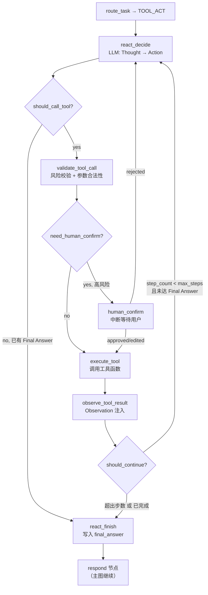

# ReAct 集成方案 — Nexa Agent TOOL_ACT 子图设计

> 版本：V1.1 | 日期：2026-06-11 | 基于 react_exp 实验模块 + SPEC.md 现状 + Milvus 知识库

---

## 1. 背景

### 1.1 当前代码现状

**路由层**：
- `RouteType.TOOL_ACT` 已定义，路由关键词匹配后走 `tool_act_placeholder`
- L1 关键词（"重启设备/生成工单/发送邮件/部署/发布..."）命中 → RouteType.TOOL_ACT

**图节点**：
- `tool_act_placeholder`：占位节点，返回 `"[TOOL_ACT 暂未实现]"`
- 图中仅有一行 `builder.add_edge("tool_act_placeholder", "respond")`

**AgentState ReAct 字段（已定义但未使用）**：
- `tool_calls: list[ToolCallRecord]`（append_list reducer）
- `tool_results: list[ToolCallRecord]`（append_list reducer）
- `pending_tool_call: ToolCallRecord | None`
- `react_decision_summary: str | None`
- `react_finished: bool`
- `need_human_confirm: bool`
- `human_confirm_request: HumanConfirmRequest | None`
- `human_confirm_result: HumanConfirmResult | None`

### 1.2 react_exp 实验模块提供的

| 组件 | 文件 | 可复用性 |
|------|------|---------|
| ReAct 主循环 | `react_agent.py` | 需重构为 LangGraph 子图节点 |
| 8 个工具 + 注册表 | `tools.py` | **可直接复用**，接口统一 `tool(param) -> str` |
| System Prompt | `prompts/react_system.txt` | 可直接复用 |
| LLM 响应解析 | `parse_llm_response()` | 需适配 LangGraph 回调模式 |
| Thinking 模式控制 | `call_llm()` | 需集成到统一的 LLM 客户端 |
| 策展步骤 | `_curation_step()` | 可映射到 LTM Memory Gate |
| 图片分析工具 | `analyze_image / analyze_image_cloud` | 与现有 VLM 管线重叠，需整合 |

---

## 2. 架构设计：TOOL_ACT 子图

### 2.1 整体结构

`TOOL_ACT` 不再是单节点，而是 LangGraph 子图（subgraph），包含 7 个内部节点：



### 2.2 与主图的关系

```
route_task
    │
    ├── VISION_DIRECT → ...
    ├── VISION_SCHEMA → ...
    ├── RAG_QA → ...
    ├── TOOL_ACT → react_subgraph → respond → update_memory → END
    └── FALLBACK → ...
```

TOOL_ACT 子图替换 `tool_act_placeholder`，作为 LangGraph 子图注册到主图中。子图内部完成后，经由 `react_finish` 节点的 `final_answer` 进入 `respond` → `update_memory`。

子图使用同一个 `AgentState`，只读写 ReAct 相关字段。

---

## 3. 节点设计

### 3.1 `react_decide` — LLM 推理决策

**职责**：调用 LLM，让其规划下一步的 Thought + Action，或输出 Final Answer。

**输入**：
- `user_input`（用户原始问题）
- `image_refs`（可选图片引用）
- `tool_results`（历史工具执行结果，作为观察上下文）
- `short_term_context`（STM 上下文）

**输出**：
- LLM 响应解析为 `{thought, action, action_args, final_answer}`
- 写入 `react_decision_summary`（thought 摘要）
- 追加 `ModelCallRecord`

**LLM 调用方式**：
- 复用 `app/llm/client.py` 的 LLM 客户端（DeepSeek V4 Pro 作为推理模型）
- 使用 `react_exp/prompts/react_system.txt` 作为 System Prompt
- 工具描述由 Tool Registry 动态生成（`get_tools_description()`）
- 消息历史：system prompt + 用户消息 + Assistant 历史回复 + Observation 注入
- 启用 DeepSeek thinking 模式（首步 + 工具失败后）

**条件边** → `should_call_tool`：
```
if parsed["final_answer"] → "react_finish"
else → "validate_tool_call"
```

### 3.2 `validate_tool_call` — 工具调用校验

**职责**：校验 LLM 输出的 Action 是否合法。

**检查点**：
- 工具名是否在 Tool Registry 中注册（不存在 → 返回错误 Observation，回 `react_decide`）
- 参数格式是否合法（空参数/格式错误 → 返回错误，回 `react_decide`）
- 工具风险等级判断（高风险 → `need_human_confirm=True`）

**工具风险分级**：

| 级别 | 工具 | 处理 |
|------|------|------|
| LOW | `calculator / web_search / wikipedia_search / get_current_time / analyze_image` | 直接执行 |
| MEDIUM | `tavily_extract / analyze_image_cloud` | 直接执行，记录审计 |
| HIGH | 未来 `send_email / deploy / restart` 等 | 需人工确认 |

**输出**：
- 写入 `pending_tool_call: ToolCallRecord`
- 高风险时设置 `need_human_confirm=True`, `human_confirm_request`
- 更新 `step_count`

**条件边** → `need_human_confirm`：
```
if need_human_confirm and not human_confirm_result → "human_confirm"
else → "execute_tool"
```

### 3.3 `human_confirm` — 人工确认中断

**职责**：高风险工具调用前暂停，等待用户确认。

**实现**：
- V0 阶段：不阻塞，默认通过（返回 `decision="approved"`）
- V1 阶段：使用 LangGraph `interrupt()` 挂起图执行，通过 SSE 推送确认请求到前端

**输出**：
- 写入 `human_confirm_result: HumanConfirmResult`
- approved → 进入 `execute_tool`
- rejected → 回 `react_decide`（通知 LLM 工具被拒绝，需换策略）
- edited → 用编辑后的参数进入 `execute_tool`

### 3.4 `execute_tool` — 工具执行

**职责**：根据 AgentState 中的 `pending_tool_call` 执行实际工具函数。

**执行流程**：
```
pending_tool_call.tool_name → Tool Registry → tool_func(tool_input)
→ 结果写入 tool_results（append_list reducer）
```

**关键约束**：
- 每步只执行一个工具（与 react_exp 一致）
- 执行超时 30 秒（LLM 调用除外）
- 工具异常不中断子图，结果作为错误 Observation 返回
- 写入 `ToolCallRecord`：
  ```python
  ToolCallRecord(
      tool_call_id=uuid,
      tool_name=pending_tool_call.tool_name,
      tool_input=pending_tool_call.tool_input,
      status=ToolCallStatus.SUCCESS / FAILED,
      tool_output={"observation": result_str},
      latency_ms=elapsed,
  )
  ```

**条件边** → `observe_tool_result`（固定）

### 3.5 `observe_tool_result` — 观察注入

**职责**：将工具执行结果格式化为 Observation，注入 LLM 对话历史。

**格式**：
```
Observation: {tool_output_text}
```

**条件边** → `should_continue`：
```
if step_count >= max_steps → "react_finish"
else → "react_decide"
```

### 3.6 `react_finish` — 子图完成

**职责**：子图收敛，写回最终状态。

**行为**：
- 如果 `final_answer` 非空 → 写入 `final_answer`，标记 `react_finished=True`
- 如果 `final_answer` 为空（达到最大步数但无答案）→ 触发一次兜底 LLM 调用，基于所有 Observation 生成 `final_answer`
- 追加 `ActionTraceItem`

**条件边** → 主图 `respond` 节点

---

## 4. Tool Registry 设计

### 4.1 工具统一接口

从 react_exp 继承的 `TOOLS` 注册表：

```python
# app/tools/registry.py
TOOLS: dict[str, Callable[[str], str]] = {}
TOOL_META: dict[str, dict] = {}

def register(name, description, signature, examples):
    """装饰器注册工具"""
```

### 4.2 工具列表（V0 集成）

| 工具 | 来源 | 说明 |
|------|------|------|
| `web_search` | react_exp | Tavily 优先，DuckDuckGo 兜底 |
| `wikipedia_search` | react_exp | Wikipedia REST API |
| `tavily_extract` | react_exp | 网页内容提取（内存缓存） |
| `calculator` | react_exp | numexpr 安全计算 |
| `get_current_time` | react_exp | 本地时间 |
| `analyze_image` | **整合** | 复用现有 `LlamaCppVLMEngine`，不重复实现 |
| `save_content` | react_exp → V1 | 后续对接 LTM |
| `analyze_image_cloud` | react_exp → V1 | Kimi K2.6 云端 VLM |

> `analyze_image` 不重复实现——直接调用 `app/pipeline/llamacpp_vlm.py` 的 `LlamaCppVLMEngine.analyze_image()`，保持 VLM 管线统一。

### 4.3 文件位置

```text
app/
  tools/
    __init__.py           # TOOLS 注册表 + execute_tool + get_tools_description
    web_search.py         # web_search + wikipedia_search
    content_extract.py    # tavily_extract + save_content
    calculator.py         # calculator
    time_tool.py          # get_current_time
    image_tools.py        # analyze_image（调 LlamaCppVLMEngine）+ analyze_image_cloud

  agent/
    nodes/
      react_decide.py       # react_decide 节点
      react_validate.py     # validate_tool_call + need_human_confirm 判断
      react_execute.py      # execute_tool 节点
      react_observe.py      # observe_tool_result 节点
      react_finish.py       # react_finish 节点
      react_routers.py      # should_call_tool / should_continue 路由函数
```

---

## 5. 数据流变更

### 5.1 AgentState 新增字段

**无需新增**。当前 AgentState 已包含全部 ReAct 所需字段（§1.1 所列）。仅需填充和使用。

### 5.2 图编译变更

```python
# graph.py 改动
from app.agent.nodes.react_decide import react_decide
from app.agent.nodes.react_validate import validate_tool_call
from app.agent.nodes.react_execute import execute_tool
from app.agent.nodes.react_observe import observe_tool_result
from app.agent.nodes.react_finish import react_finish
from app.agent.nodes.react_routers import should_call_tool, should_continue_reasoning

# 替换 tool_act_placeholder → react_subgraph
react_subgraph = StateGraph(AgentState)
react_subgraph.add_node("react_decide", react_decide)
react_subgraph.add_node("validate_tool_call", validate_tool_call)
react_subgraph.add_node("execute_tool", execute_tool)
react_subgraph.add_node("observe_tool_result", observe_tool_result)
react_subgraph.add_node("react_finish", react_finish)

react_subgraph.set_entry_point("react_decide")
react_subgraph.add_conditional_edges("react_decide", should_call_tool, {
    "validate_tool_call": "validate_tool_call",
    "react_finish": "react_finish",
})
react_subgraph.add_conditional_edges("validate_tool_call", should_confirm_tool, {
    "execute_tool": "execute_tool",
    "react_decide": "react_decide",  # rejected
})
react_subgraph.add_edge("execute_tool", "observe_tool_result")
react_subgraph.add_conditional_edges("observe_tool_result", should_continue_reasoning, {
    "react_decide": "react_decide",
    "react_finish": "react_finish",
})

# V0: human_confirm 是 pass-through 节点
# react_subgraph.add_node("human_confirm", human_confirm)
# react_subgraph.add_edge("human_confirm", "execute_tool")

# 主图注册
builder.add_node("react_subgraph", react_subgraph.compile())
# route_task → TOOL_ACT → react_subgraph
builder.add_edge("route_task", ..., {"tool_act_placeholder": "react_subgraph", ...})
```

### 5.3 路径表更新

| 路径 | LLM | VLM | 外部工具 | STM | LTM |
|------|-----|-----|---------|-----|-----|
| TOOL_ACT（V0.5） | 2-6（每步 1 次 LLM） | 按需 | ✅ 6 个工具 | ✅ | ❌ |

---

## 6. 增量计划

### 6.1 阶段 A — 基础工具链路（P0，可最快跑通）

1. 创建 `app/tools/` 目录，迁移 `web_search / wikipedia_search / calculator / get_current_time` 四个纯文字工具
2. 创建 `app/tools/registry.py`，复用 `@register` 装饰器和 `TOOLS` 注册表
3. 集成 `analyze_image`（复用 `LlamaCppVLMEngine`，非重复实现）
4. 实现 `react_decide` + `execute_tool` + `react_finish` 三个最小节点
5. 最小子图：`react_decide → execute_tool → observe → react_decide | react_finish`
6. System Prompt 从 `react_exp/prompts/react_system.txt` 迁移，动态注入工具描述
7. 主图 TOOL_ACT 路由连接到子图

### 6.2 阶段 B — 校验与安全（P1）

1. `validate_tool_call` 节点：工具名校验 + 参数格式检查
2. 工具风险分级（LOW/MEDIUM/HIGH）
3. `human_confirm` 节点（V0 pass-through）
4. 工具超时保护
5. 工具执行 Trace 事件（`tool_call_started / completed / failed`）

### 6.3 阶段 C — 内容提取与知识库构建（P2）

1. 迁移 `tavily_extract` + `save_content`
2. `save_content` → 写入 SQLite `kb_documents` 表（原文） + Milvus `kb_documents` 集合（向量索引）
3. `retrieve` 节点在检索时同时查 LTM（SQLite） + KB（Milvus 向量搜索）
4. 移除 react_exp 的磁盘落文件逻辑，改为 SQLite + Milvus 双写

### 6.4 阶段 D — 完整化（P2）

1. `analyze_image_cloud`（Kimi K2.6 云端 VLM）
2. `human_confirm` 正式实现（LangGraph `interrupt()`）
3. 子图 Trace 可视化（React step timeline in frontend）

---

## 7. 设计决策

### ADR-ReAct-001: 子图而非 Node 内 while 循环

**决策**：ReAct 的 Thought → Action → Observation 循环实现为 LangGraph 子图，而非单个 Node 内的 `while step < max_steps`。

**原因**：
- 每步都是显式的图状态变更，Trace 可记录每个节点事件
- 支持 LangGraph `interrupt()` 实现人工确认
- 每个节点独立可测试
- 符合 SPEC §13 约束：ReAct 循环必须是子图或显式节点循环

### ADR-ReAct-002: 复用 LlamaCppVLMEngine，不复写 VLM 调用

**决策**：`analyze_image` 工具直接调用现有 `LlamaCppVLMEngine.analyze_image()`，不重新实现 base64 编码、OpenAI API 调用的全套逻辑。

**原因**：
- VLM 管线已有完善的缓存、日志、prompt 管理
- 避免两份 VLM 调用代码不一致
- react_exp 的 `analyze_image` 实现与 `llamacpp_vlm.py` 本质上相同

### ADR-ReAct-003: System Prompt 从文件加载

**决策**：ReAct System Prompt 从 `prompts/react_system.txt` 加载，不在代码中硬编码。

**原因**：
- Prompt 需要频繁迭代调试
- 工具描述由 `get_tools_description()` 动态拼接
- 符合 react_exp 的现有设计

### ADR-ReAct-004: V0 不实现 human_confirm 阻塞

**决策**：V0 阶段 `human_confirm` 节点为 pass-through（默认 approved），高风险工具仅记录审计日志。

**原因**：
- HITL 需要 Streamlit 长轮询 + LangGraph `interrupt()` 支持
- 当前无高风险工具（send_email/deploy 等尚未实现）
- V1 结合参数化校验再实现完整中断

---

## 8. 知识库存储架构（SQLite + Milvus）

### 8.1 双存储模型

```
           ┌──────────────────────┐
           │   SQLite (原文存储)     │
           │   kb_documents 表      │
           │   ├── doc_id           │
           │   ├── title            │
           │   ├── content          │  ← 展示 + 检索用摘要
           │   ├── content_full     │  ← 完整原文
           │   ├── content_hash     │  ← SHA256 去重
           │   ├── source_url       │
           │   ├── doc_type         │
           │   ├── tags             │
           │   └── status           │
           └──────────┬─────────────┘
                      │ doc_id
           ┌──────────▼─────────────┐
           │   Milvus (向量检索)     │
           │   kb_documents 集合     │
           │   ├── doc_id (PK)      │
           │   ├── title            │
           │   ├── content          │  ← embedding 输入源
           │   ├── vector (768d)    │  ← content 的 embedding
           │   ├── doc_type         │
           │   ├── tags             │
           │   └── status           │
           └────────────────────────┘
```

**SQLite 存原文，Milvus 管检索。** 写入时双写（同一个事务或补偿），检索时 Milvus 返回 doc_id → SQLite 取原文。Milvus 标量字段做过滤（doc_type / tags / status），向量字段做相似度排序。

### 8.2 Milvus 集合设计

参考 `milvus_manager.py` 的封装模式，创建 `kb_documents` 集合：

```python
from pymilvus import MilvusClient

class KBMilvusStore:
    """知识库 Milvus 存储 — 对齐 milvus_manager.py 接口风格"""
    
    def __init__(self, uri: str = None, collection_name: str = "kb_documents"):
        self.client = MilvusClient(uri=uri)  # Lite 模式自动本地，上云传 URI
        self.collection_name = collection_name
        self._ensure_collection()
    
    def _ensure_collection(self):
        if not self.client.has_collection(self.collection_name):
            self.client.create_collection(
                collection_name=self.collection_name,
                dimension=768,                    # 对齐 embedding 模型维度
                auto_id=False,
                enable_dynamic_field=True,
            )
            # 创建向量索引
            index_params = self.client.prepare_index_params()
            index_params.add_index(
                field_name="vector",
                index_type="IVF_FLAT",
                metric_type="COSINE",
                params={"nlist": 128},
            )
            self.client.create_index(self.collection_name, index_params)
    
    def insert(self, doc_id: str, title: str, content: str, 
               vector: list[float], doc_type: str, tags: list[str]):
        self.client.insert(collection_name=self.collection_name, data=[{
            "doc_id": doc_id,
            "title": title,
            "content": content[:2000],
            "vector": vector,
            "doc_type": doc_type,
            "tags": tags,
            "status": "active",
        }])
    
    def search(self, query_vector: list[float], top_k: int = 8,
               doc_type: str = None, tags: list[str] = None) -> list[dict]:
        filter_parts = ['status == "active"']
        if doc_type:
            filter_parts.append(f'doc_type == "{doc_type}"')
        if tags:
            tag_conditions = " or ".join([f'tags like "%{t}%"' for t in tags])
            filter_parts.append(f"({tag_conditions})")
        
        results = self.client.search(
            collection_name=self.collection_name,
            data=[query_vector],
            limit=top_k,
            filter=" and ".join(filter_parts),
            output_fields=["doc_id", "title", "content", "doc_type", "tags"],
        )
        return results[0] if results else []
    
    def delete(self, doc_id: str):
        self.client.delete(collection_name=self.collection_name,
                          filter=f'doc_id == "{doc_id}"')
```

### 8.3 SQLite kb_documents 表

```sql
-- app/storage/models.py 新增
class KBDocument(Base):
    __tablename__ = "kb_documents"
    
    id = Column(Integer, primary_key=True, autoincrement=True)
    doc_id = Column(String(128), unique=True, nullable=False, index=True)
    title = Column(String(512))
    content = Column(Text, nullable=False)           -- 检索用摘要，≤ 2000 字符
    content_full = Column(Text)                      -- 完整原文，展示用
    content_hash = Column(String(128), unique=True)  -- SHA256 去重
    source_url = Column(Text)
    doc_type = Column(String(32), nullable=False)    -- web_article / research_report / user_upload
    tags_json = Column(Text, default="[]")
    extracted_at = Column(DateTime, default=datetime.utcnow)
    last_used_at = Column(DateTime)
    use_count = Column(Integer, default=0)
    status = Column(String(16), default="active")    -- active / archived
    created_at = Column(DateTime, default=datetime.utcnow)
```

### 8.4 `save_content` 工具改造

```python
@register(name="save_content", ...)
def save_content(filename: str) -> str:
    extract = _session_extracts[-1]
    doc_id = f"kb_{uuid.uuid4().hex[:12]}"
    content_summary = extract["raw_content"][:2000]
    
    # 1. 写 SQLite（原文）
    kb_sqlite = get_kb_sqlite_store()
    kb_sqlite.add_document(KBDocument(
        doc_id=doc_id,
        title=extract.get("title", filename),
        content=content_summary,
        content_full=extract["raw_content"],
        content_hash=sha256(extract["raw_content"]),
        source_url=extract.get("url", ""),
        doc_type="web_article",
        tags=extract.get("tags", []),
    ))
    
    # 2. 写 Milvus（向量索引）
    kb_milvus = get_kb_milvus_store()
    embedding = embed_model.embed(content_summary)
    kb_milvus.insert(
        doc_id=doc_id,
        title=extract.get("title", ""),
        content=content_summary,
        vector=embedding,
        doc_type="web_article",
        tags=extract.get("tags", []),
    )
    
    return f"已存入知识库: {extract.get('title', filename)}"
```

### 8.5 `retrieve` 节点增强

```python
def retrieve(state: AgentState) -> dict:
    # ... 现有 LTM 检索 ...
    
    # 新增：知识库检索（Milvus）
    kb_milvus = get_kb_milvus_store()
    query = state.get("user_input", "")
    embedding = embed_model.embed(query)
    kb_results = kb_milvus.search(embedding, top_k=5)
    
    for r in kb_results:
        ctx_items.append(EvidenceItem(
            source_type="knowledge_base",
            source_id=r["doc_id"],
            title=r.get("title", ""),
            content=r.get("content", "")[:500],
            metadata={
                "doc_type": r.get("doc_type"),
                "tags": r.get("tags", []),
            },
        ))
    
    # 记录使用
    if kb_results:
        kb_sqlite.record_use([r["doc_id"] for r in kb_results])
```

---

## 9. 与现有模块的交互

### 9.1 与 LLM 客户端

React 节点通过 `app.api.deps.get_llm_client()` 获取 LLM 客户端，不直接创建 OpenAI 客户端。DeepSeek thinking 模式控制通过 `chat(kwargs={extra_body: {"thinking": {"type": "enabled/disabled"}}})` 传递。

### 9.2 与 VLM 管线

`analyze_image` 工具内部调用 `get_extraction_pipeline()` → `pipeline._vlm_engine.analyze_image()`。不绕过缓存机制。

### 9.3 与 STM / LTM / KB

- React 步骤的 Thought / Action / Observation 摘要写入 STM
- 知识库: `save_content` → SQLite（原文）+ Milvus（向量索引），`retrieve` 节点同时查 LTM + KB
- 策展步骤移除，内容价值判断由 LLM 在 ReAct 中直接决定 + Memory Gate 二次确认

### 9.4 与 Trace

每次 react_decide 调用产生 `model_call_completed` 事件，每次 execute_tool 产生 `tool_call_completed / tool_call_failed` 事件。子图节点流在前端 Timeline 中展示为独立的步骤组。

---

## 10. 工具 System Prompt 动态生成

```
tool_descriptions = get_tools_description()
system_prompt = load_react_system_prompt()
final_prompt = system_prompt + "\n\n" + tool_descriptions
```

`get_tools_description()` 遍历 `TOOL_META` 生成：
```
- **web_search(query)**: 搜索互联网，Tavily 优先。示例: web_search(2025年诺贝尔奖)
- **calculator(expression)**: 安全数学计算。示例: calculator(2+2)
...
```

---

## 11. 风险与边界

| 风险 | 处理 |
|------|------|
| ReAct 循环无限执行 | `max_steps=6` 硬限制，达到后强制 react_finish 兜底 |
| LLM 输出格式错误 | `parse_llm_response` 容错 + 错误 Observation 注入纠正 |
| 工具执行超时 | 30 秒超时，超时后返回错误 Observation |
| 工具返回内容过大 | Observation 截断到 2000 字符 |
| web_search API 不可用 | DuckDuckGo 兜底 |
| Tavily API Key 未配置 | 返回明确错误，不静默失败 |
| 子图状态泄漏 | 子图使用同一个 AgentState，但只读写 ReAct 相关字段，不污染其他路径的状态 |

---

## 12. 验收标准

1. 路由命中 `TOOL_ACT` → 进入 ReAct 子图
2. `react_decide` 正确调用 LLM 并解析 Thought / Action / Final Answer
3. 工具执行成功返回 Observation 并注入对话历史
4. Final Answer 正确写入 `AgentState.final_answer`
5. 达到 `max_steps` 时兜底汇总触发
6. 所有工具调用产生 Trace 事件
7. 所有 ActionTrace 写入 `action_trace`
8. 子图内部的 LLM 调用次数计入 `model_calls`
9. STM 正确记录 ReAct 步骤摘要
10. 不新增 AgentState 字段（使用现有字段）
